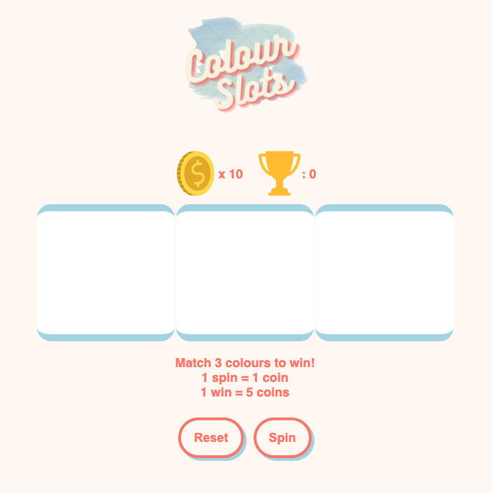
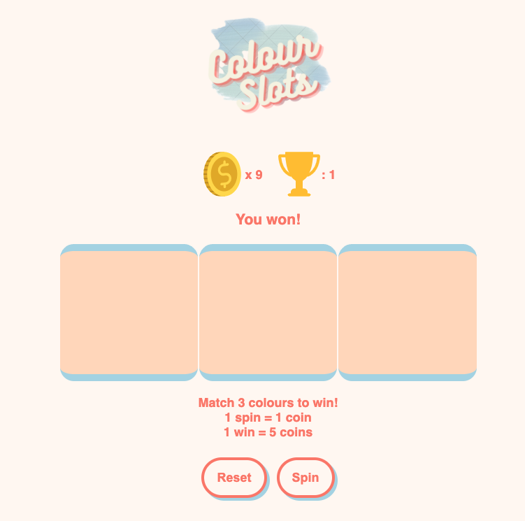
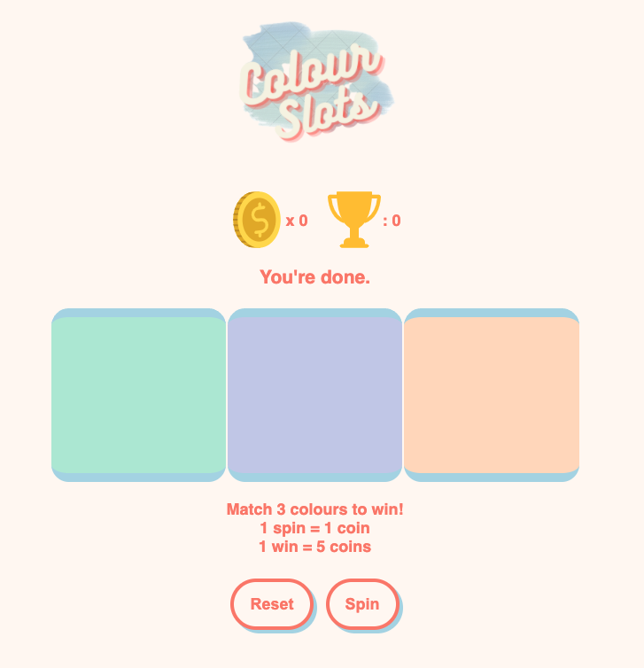

Colour Slot Machine Game

The goal of the game is to generate three matching colours to win. User will click the spin button that will generate three random colours. User wins when three colours match. User loses when coins run out without a win.

TECHNOLOGIES USED:
Javascript, HTML, CSS

GETTING STARTED:
 
<a href="https://joannewckam.github.io/firstGAproject">Demo</a>

CHALLENGES:

1. Assigning colours from randomly generated number as a string
2. setInterval and setTimeout to stop the generated colours at different times
3. winCount went up on the first lever click because of the setTimeout - fixed by 4. calling the checkWin function after the last spin

NEXT STEPS:

1. make an icon reel
2. animate reel spin

PSEUDOCODE
Variables/State:

- reels
- winCount
- coins

Elements:

- Lever to start
- Button to reset

Display

- number of coins
- three sets of colours
- total wins

Event Listeners

- Lever > spins the colours
- button > reset/restart

GAME LOGIC:

1. Three displays for the colour reels start blank
2. User starts with 10 coins to play
3. Click lever button to start
   1. Display will randomly generate three colours
   2. Both buttons disabled until the last spin
   3. Check to see if the 3 generated colours match
      1. If the three colours match - display win message, win count goes up by 1 and user gets +5 coins
      2. If they do not match no message will display and coin count goes down by 1
4. User is able to continue clicking the lever until the coins run out
   1. When coins reach 0 a message will display that user is out of tokens to play
   2. The lever button is disabled to prompt user to click the reset button to start again
5. Reset button returns to initial state of 10 coins, 0 wins and white display
